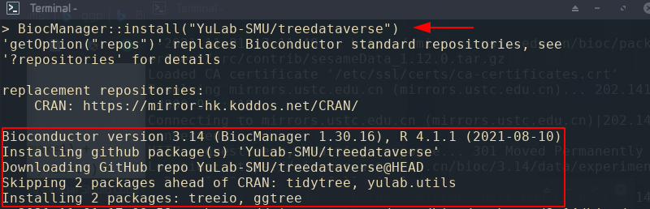

# treedataverse

<!-- badges: start -->
<!-- badges: end -->

The goal of `treedataverse` is to make it easy to install and load multiple 'treedataverse' packages (mainly `tidytree`, `treeio`, `ggtree`, and `ggtreeExtra`) in a single step.

## Installation

You can install the development version of `treedataverse` like so:

``` r
## install.packages("BiocManager")
BiocManager::install("YuLab-SMU/treedataverse")
```




## Usage

`library(treedataverse)` will load the core `treedataverse` packages:


